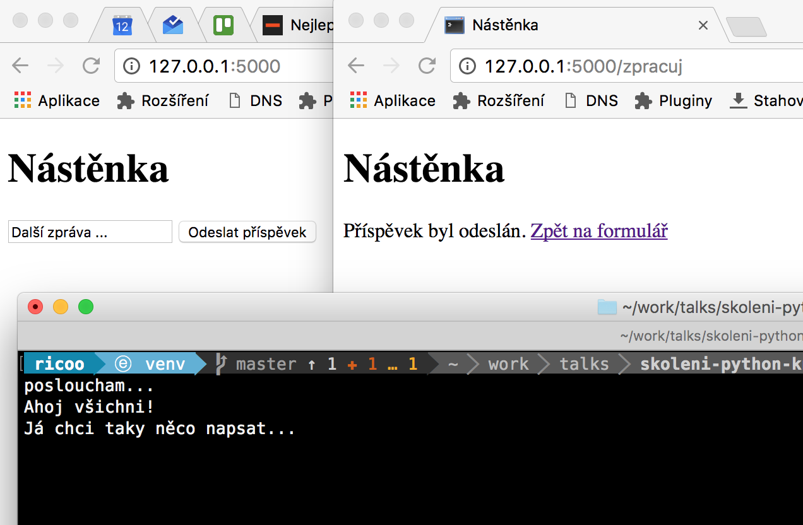

# Nástěnka

Zadáním je vytvořit 2 aplikace. První z nich, velmi jednoduchý server, bude poslouchat a vypisovat všechny přijaté zprávy na společnou nástěnku.

Druhá z nich, klient, bude webová aplikace, která bude obsahovat dvě stránky (formulář + potvrzení odeslání). Pomocí formuláře půjde odeslat příspěvek na server.

## Server

- použijeme knihovnu `pyzmq` ([dokumentace](https://pyzmq.readthedocs.io)) - importuje se jako `zmq`
- mód komunikace bude PULL ([popis návrhového vzoru](learning-0mq-with-pyzmq.readthedocs.io/en/latest/pyzmq/patterns/pushpull.html))

*1. úkol: Vytvořte funkci `poslouchej()`, která otevře PULL ZeroMQ socket na TCP portu `6633` pro všechny příchozí spojení. Pak bude v nekonečné smyčce přijímat data a vypisovat je na konzoli.*

## Klient

- opět použijeme `pyzmq`, tentokrát v módu PUSH

*2. úkol: Vytvořte funkci `odesli_na_server(text)`, která otevře PUSH ZeroMQ socket, připojí se na server a odešle předaný text.*

## Webové prostředí

- použijeme knihovnu `flask` ([dokumentace](http://flask.pocoo.org))
- šablonovací jazyk se jmenuje Jinja2 ([dokumentace](http://jinja.pocoo.org/docs/latest))

*3. úkol: Vytvořte šablony `formular.html` a `potvrzeni.html`, do formuláře vytvořte textové pole s názvem `prispevek`.*

*4. úkol: Vytvořte funkce `zobraz_formular()` a `zpracuj_formular()`, které namapujte pomocí `flask` dekorátorů na HTTP cesty. Vykreslete příslušné šablony.*

*5. úkol: Propojte odeslání HTML formuláře s voláním funkce `zpracuj_formular()`. Zároveň zařiďte, ať lze funkci zavolat pouze odesláním formuláře a nijak jinak.*

*6. úkol: Do funkce `zpracuj_formular()` doplňte použití funkce `odesli_na_server(text)`.*

*7. úkol: Pošlete váš oblíbený vtip na nástěnku. :-)*

**Hurá, hotovo!**
