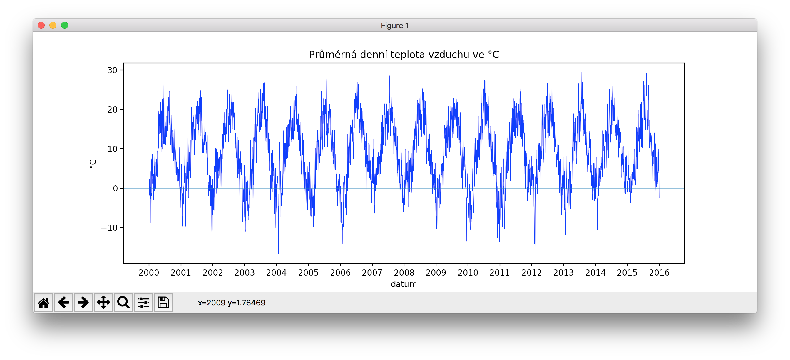

# Rosnička



Zadáním je vytvořit aplikaci, která:

1. stáhne z webu data o počasí,
2. přečte webovou stránku a vrátí dobře zpracovatelnou datovou strukturu (slovník),
3. vykreslí graf s výsledky,
4. půjde pohodně ovládat z příkazové řádky.


## Stahování dat z webu

- použijeme knihovnu `requests` ([dokumentace](http://docs.python-requests.org/))
- stahovaná data jsou na adrese: https://tbedrich.cz/meteo.html

*1. úkol: Vytvořte funkci `stahni()`, která stáhne webovou stránku a vrátí ji jako text.*


## Parsování dat z webové stránky

- použijeme knihovnu `BeautifulSoup4` ([dokumentace](https://www.crummy.com/software/BeautifulSoup/bs4/doc/)) - importuje se jako `bs4`
- pro inspekci HTML použijeme Chrome Dev Tools (*Pravá myška > Prozkoumat prvek*)
- při vyhledávání elementů v "polívce" používáme metodu `select()` (případně `select_one()`), která podporuje CSS selektory
- nalezená data "vyčistíme" - čísla na `int()`, datumy na `datetime`, ...


*2. úkol: Vytvořte funkci `zpracuj(web_stranka, nazev_datasetu)`, která z předané webové stránky vytáhne dataset a vrátí ho jako slovník s následující strukturou:*

```python
{
    'nadpis': 'Průměrná denní teplota vzduchu',
    'jednotky': '°C',
    'hodnoty': [
        (datetime.date(2016, 1, 1), -2.2),
        (datetime.date(2016, 1, 2), -1.0),
        (datetime.date(2016, 1, 3), 3.8),
    ],
}
```

## Vykreslení grafu

- použijeme knihovnu `matplotlib` ([dokumentace](http://matplotlib.org/api/pyplot_api.html)) - importujeme `matplotlib.pyplot`

*3. úkol: Vytvořte funkci `vykresli_spojnice(hodnoty, nadpis, jednotky)`, která z hodnot (= seznam dvojic datum, hodnota) vykreslí spojnicový graf. Ten bude mít příslušný nadpis, popisky os a horizontální vodící čáru v bodě 0.*

*4. úkol: Vytvořte funkci `vykresli_sloupce(hodnoty, nadpis, jednotky)`, která se oproti předchozí funkci bude lišit pouze tím, že vykreslí graf sloupcový.*


## Konzolové uživatelské rozhraní

- použijeme knihovnu `click` ([dokumentace](http://click.pocoo.org))

*5. úkol: Vytvořte funkci `teploty()`, která použije funkce `stahni()`, `zpracuj()` a `vykresli_spojnice()`, čímž vykreslí graf ze stažených dat – pozor, bude třeba omezit množství vykreslovaných dat.*

*6. úkol: Vytvořte funkci `srazky()`, která bude fungovat podobně jako předchozí, jen použije funkci `vykresli_sloupce()`.*

*7. úkol: Vytvořte prázdnou funkci `main()`. Přidejte k funkcím `main()`, `teploty()` a `srazky()` dokumentační komentáře a dekorátory knihovny `click` tak, aby bylo možné použití následujícíh příkazů:*

```bash
python3 rosnicka.py --help
python3 rosnicka.py teploty
python3 rosnicka.py srazky
```

*8. úkol: Doplňte k funkci `teploty()` dekorátory knihovny `click` tak, aby bylo možné omezit rozsah dat pomocí následujícího příkazu:*

```bash
python3 rosnicka.py teploty --od 1988 --do 1990
```

**Hurá, hotovo!** Další vylepšení dle osobních preferencí. :-)
